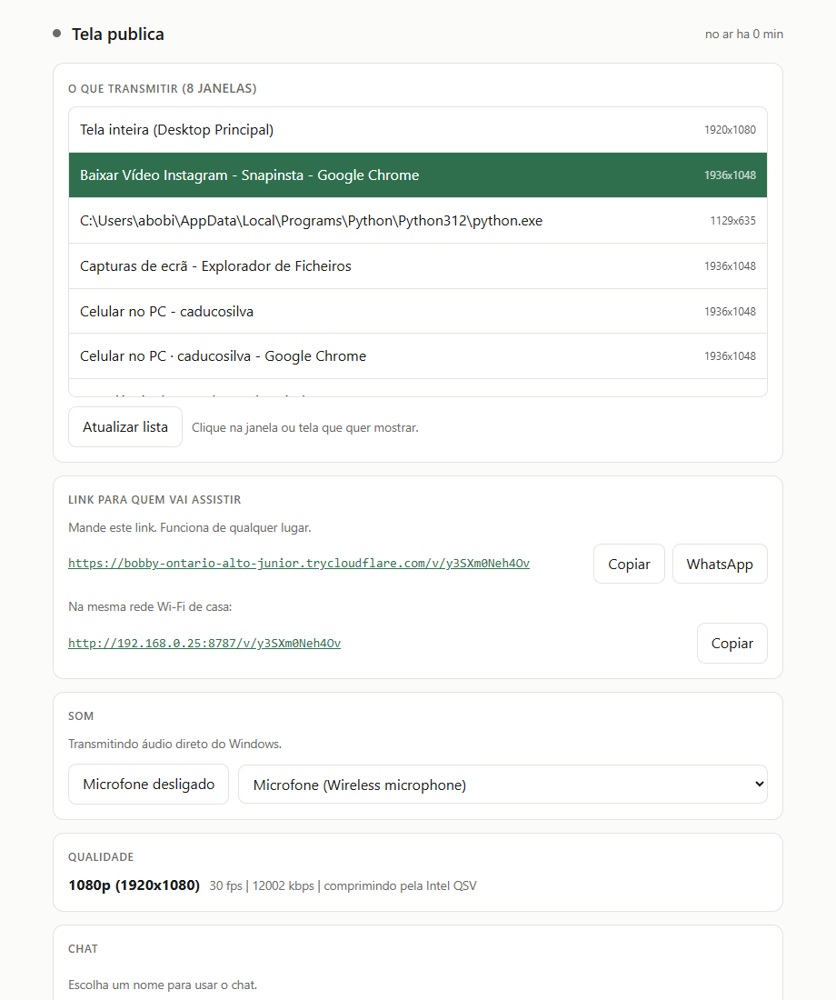
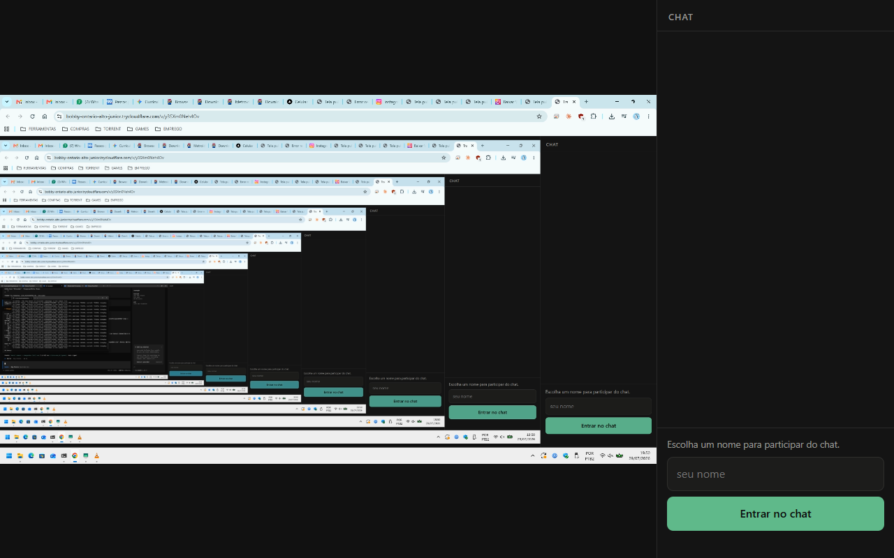
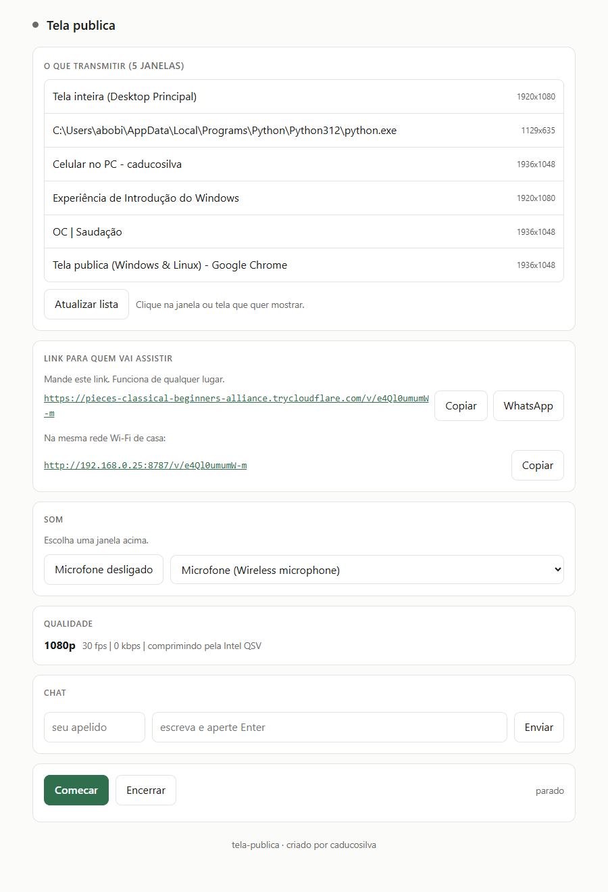

# tela-publica

Transmite uma janela do seu computador para alguem assistir pelo navegador, de
qualquer lugar, sem instalar nada do outro lado.

Versao atual do script: **4.7** (Windows 10/11 + Linux X11).

## Por que existe

Eu queria assistir um filme junto com minha namorada, cada um na sua casa. As
opcoes eram todas ruins: programa de chamada de video comprime a imagem ate
virar borrao e corta o audio quando ninguem fala, servico de terceiro grava o
que voce mostra, e abrir porta no roteador nao funciona quando a operadora usa
CGNAT.

Este projeto resolve com poucos arquivos. Voce abre, clica na janela do player,
manda o link. Do outro lado e so abrir no navegador do celular ou do
computador. Nada para instalar, nada para configurar, nada gravado.

## Telas

| Painel | Visor | Link |
| --- | --- | --- |
|  |  |  |

## Recursos

- **Imagem sempre igual.** 1920x1080 a 30 fps. A janela entra centralizada
  nesse quadro, com tarja preta no que sobrar, entao a resolucao nunca muda no
  meio da transmissao e o player de quem assiste nao fica reconectando.
- **Som apenas da janela escolhida.** No Linux o audio do programa vai para um
  destino proprio no PipeWire. No Windows (10 2004+/11) a captura usa WASAPI
  process loopback: se voce escolheu o VLC, so o VLC entra na transmissao.
  Notificacao, musica e som de outras janelas nao vao junto.
- **Microfone com botao de mudo.** Ligue so quando quiser falar com quem
  assiste, para avisar que travou. Liga e desliga na hora, sem cortar a imagem.
- **Chat que nao guarda nada.** As mensagens existem apenas na memoria e somem
  sozinhas um minuto depois. Cada pessoa escolhe um apelido e pode mandar uma
  mensagem a cada 5 segundos, o que evita enchente de texto.
- **Link publico sem mexer no roteador.** Usa o cloudflared para criar um
  endereco HTTPS temporario. Funciona mesmo com CGNAT.
- **Qualidade que se ajusta sozinha.** Se a conexao de quem assiste apertar,
  cai para 720p e depois 480p. Depois de 3 minutos estavel, volta para 1080p.
- **Cuida da janela minimizada.** O X11 nao entrega imagem nenhuma de janela
  minimizada. O programa restaura a janela ao comecar e, se voce minimizar no
  meio, pausa avisando e retoma sozinho quando ela volta.
- **Janela coberta funciona.** Pode deixar o filme atras de outras janelas. No
  Windows a captura usa PrintWindow; no Linux, com o compositor ligado, pega o
  conteudo real da janela.
- **Feito para o celular.** Botao de tela cheia que ja deita a tela no Android.
  Toque duplo no video faz o mesmo.

## Comeco rapido

### Windows 10/11

Requisitos: Python 3.8+ e FFmpeg no PATH (`winget install Gyan.FFmpeg`).
O cloudflared ja pode estar instalado; se nao, rode com `--instalar-cloudflared`.

```powershell
cd $env:USERPROFILE\Desktop\tela-publica
.\tela-publica.bat
```

Ou direto:

```powershell
python .\tela-publica
```

No Windows a imagem da janela usa PrintWindow (funciona coberta). O audio da
janela vem so daquele processo (`captura-audio-pid.cs`, compilado na primeira
vez com o `csc` do .NET Framework para `%LOCALAPPDATA%\tela-publica\`). Desktop
inteiro ainda pode usar Stereo Mix ou WASAPI geral. O microfone liga pelo
painel. O som enviado leva um ganho leve para nao chegar baixo no celular.
Encoder GPU (NVENC/AMF/QSV) se passar no teste; senao libx264.

### Linux

Para quem so quer usar, sao tres comandos:

```bash
sudo apt install ffmpeg wmctrl x11-utils x11-xserver-utils pulseaudio-utils pipewire-bin
curl -sSL https://raw.githubusercontent.com/caducosilva/tela-publica/main/tela-publica -o tela-publica
chmod +x tela-publica && ./tela-publica
```

O painel abre sozinho no navegador. Se quiser o link que funciona fora da sua
casa, rode uma vez `./tela-publica --instalar-cloudflared`.

## Requisitos

Roda em **Windows 10/11** e em **Linux com sessao X11**. No Linux, Wayland nao
serve, porque a captura de janela usa o X11. Na tela de login, clique na
engrenagem e escolha X11 (as vezes aparece como Xorg). O programa avisa se voce
estiver em Wayland.

| Sistema | Dependencias |
|---|---|
| Windows 10/11 | Python 3.8+, FFmpeg (`winget install Gyan.FFmpeg`), .NET Framework (csc) para audio por processo, cloudflared opcional |
| Ubuntu, Debian, Mint, Pop!_OS | `ffmpeg wmctrl x11-utils x11-xserver-utils pulseaudio-utils pipewire-bin` |
| Arch, Manjaro | `ffmpeg wmctrl xorg-xwininfo xorg-xrandr libpulse pipewire` |
| Fedora | `ffmpeg wmctrl xorg-x11-utils xorg-x11-server-utils pulseaudio-utils pipewire` |

Python 3.8 ou mais novo, sem nenhuma biblioteca de fora. No Linux, o som
separado por programa depende do PipeWire.

Quem assiste nao precisa de nada alem de um navegador atual.

## Uso

1. Abra o programa. O painel aparece no navegador.
2. Clique na janela que quer mostrar. A lista se atualiza sozinha a cada 10
   segundos.
3. Clique em **Comecar**.
4. Copie o link e mande para quem vai assistir. Tem botao de copiar e de enviar
   pelo WhatsApp.
5. Se precisar falar, escolha o microfone e clique em **Microfone desligado**
   para coloca-lo no ar.

Fechar a janela do painel encerra tudo e libera a porta.

Opcoes de linha de comando:

```bash
./tela-publica --sem-navegador          # nao abre o navegador sozinho
./tela-publica --sem-tunel              # so rede local, sem link publico
./tela-publica --porta 9000             # porta preferida para quem assiste
./tela-publica --instalar-cloudflared   # baixa o cloudflared
```

## Problemas conhecidos

| Sintoma | Causa | Solucao |
|---|---|---|
| Aviso de Wayland ao abrir | A sessao nao e X11 e a captura de janela nao funciona nela | Troque para X11 na engrenagem da tela de login |
| "Essa janela esta minimizada" | O X11 recusa a captura de janela minimizada e devolve zero quadros | Restaure a janela. O programa tenta fazer isso sozinho e retoma quando ela volta |
| A janela nao aparece na lista | Menor que 120 por 120 pixels, ou e painel do sistema | Abra a janela em tamanho normal |
| "Esperando esse programa tocar algum som" | O programa ainda nao abriu um fluxo de audio | De play. Alguns programas so criam o fluxo quando comecam a tocar |
| Travando na casa de quem assiste | A taxa nao cabe no seu envio de internet | Ele cai sozinho para 720p ou 480p. Meca seu upload em fast.com e lembre que o video usa no maximo metade dele |
| O link do tunel nao abre no seu proprio PC | O sistema guardou uma resposta negativa de DNS de antes do tunel subir | Rode `resolvectl flush-caches` |

## Estrutura

| Arquivo | O que faz |
|---|---|
| `tela-publica` | Script principal (Python, sem dependencias pip) |
| `tela-publica.bat` | Atalho Windows (acha Python/FFmpeg e inicia) |
| `captura-audio-pid.cs` | Helper WASAPI: so o PCM do PID escolhido (compilado no cache) |
| `tela-publica.ico` / `transmitir-tela.ico` | Icones |
| `tela-publica-*.png` | Capturas do painel, visor e link |

| Parte no codigo | O que faz |
|---|---|
| `MesaDeSom` | No Linux, desvia o audio do app no PipeWire; no Windows, escolhe process loopback ou som do desktop |
| `Captura` | Toca o ffmpeg, corta o video em pedacos e cuida da janela minimizada |
| `captura-audio-pid` | Helper WASAPI que manda so o PCM do PID escolhido |
| `Adaptador` | Sobe e desce a qualidade olhando como quem assiste esta indo |
| `Chat` | Mensagens na memoria, com prazo de validade e limite de envio |
| `Tunel` | Liga o cloudflared e pega o endereco publico |
| `Manipulador` | Servidor HTTP do painel e da pagina de quem assiste |

O video sai em MP4 fragmentado por HTTP e e montado no navegador com Media
Source Extensions. Isso da cerca de 2 segundos de atraso, mantem a qualidade
cheia e nao exige nenhuma biblioteca no lado de quem assiste.

Logs e cache ficam em `%LOCALAPPDATA%\tela-publica` (Windows) ou
`~/.cache/tela-publica` (Linux). Nao sobem para o GitHub.

## Seguranca

- Tudo roda na sua maquina. Nenhum video passa por servidor de terceiro, com a
  ressalva de que o tunel do Cloudflare e o caminho por onde o trafego trafega
  quando voce usa o link publico.
- O link de quem assiste carrega um token aleatorio. Sem ele, a resposta e 403.
- O painel de controle escuta apenas em 127.0.0.1 e tem chave propria, entao
  nem com o tunel aberto alguem de fora alcanca seus controles.
- O chat nao grava nada em disco e o conteudo das mensagens nunca entra no
  registro do programa.
- O microfone so entra na transmissao quando voce liga, e o botao mostra o
  estado o tempo todo.

Lembre que o link publico, enquanto estiver de pe, e acessivel por qualquer
pessoa que tenha o endereco completo. Encerre quando terminar.

## Autor

tela-publica, criado por **caducosilva**. Contato: abobicarlo@gmail.com

Outros projetos em https://github.com/caducosilva

## Apoie

Se este projeto te ajudou e voce quiser contribuir:

**PIX (chave aleatoria):** `f74458dc-2a36-49bd-9250-1cef4365ebb8`

Titular: Carlos Eduardo, Mogi das Cruzes.

## Contato

Autor: Carlos Eduardo

- LinkedIn: https://www.linkedin.com/in/carlos-da-silva20ba5740a
- Instagram: https://www.instagram.com/caducosilva
- GitHub: https://github.com/caducosilva

## Licenca

MIT. Veja o arquivo [LICENSE](LICENSE).

## Contato

Autor: Carlos Eduardo

- LinkedIn: https://www.linkedin.com/in/carlos-da-silva20ba5740a
- Instagram: https://www.instagram.com/caducosilva
- GitHub: https://github.com/caducosilva
